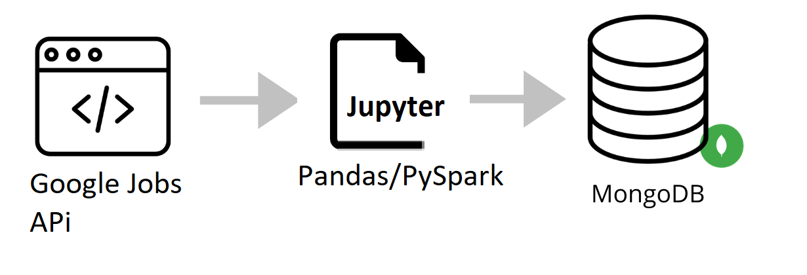

## Implementação de Pipeline ETL com Google Jobs API

Este projeto visa a implementação de uma pipeline ETL (Extração, Transformação e Carregamento) utilizando a API do Google Jobs como fonte de dados, pacotes do Python para a transformação dos dados e o MongoDB Atlas para armazenamento na nuvem.

Especificamente, a pipeline ETL foi projetada para coletar vagas de emprego de cientista de dados na região brasileira. Caso voçê queria realizar suas próprias consultas, é necessário fazer uma conta gratuita no [SerpAPi](https://serpapi.com/) para voçê obter a sua API_KEY. A partir dos dados extridos e com o uso de ferramentas de NLP como spaCy, Ntlk, etc, é possível descobrir quais as hard skills e soft skills que as empresas exigem.

# Extração de Dados
A extração de dados será feita por meio da API do Google Jobs, onde serão coletados dados sobre vagas de emprego de cientista de dados na região brasileira.

# Transformação de Dados
Os dados coletados serão transformados por meio de pacotes do Python, como Pandas e Numpy, para a limpeza e manipulação dos dados.

# Armazenamento na Nuvem
Por fim, os dados transformados serão armazenados na nuvem por meio do MongoDB Atlas, um banco de dados NoSQL baseado em nuvem.

# Instruções de Uso
As instruções detalhadas para a utilização da pipeline ETL serão fornecidas no arquivo README.md deste repositório.
